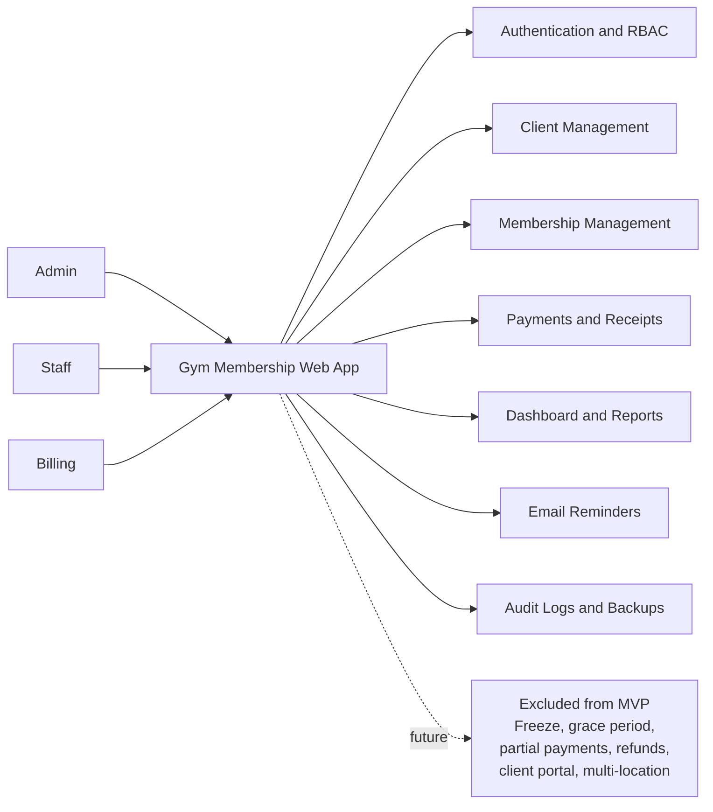
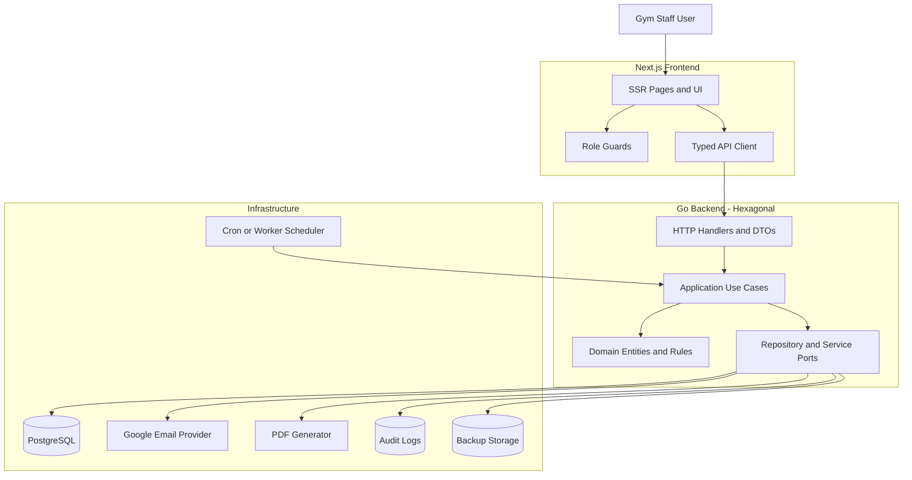
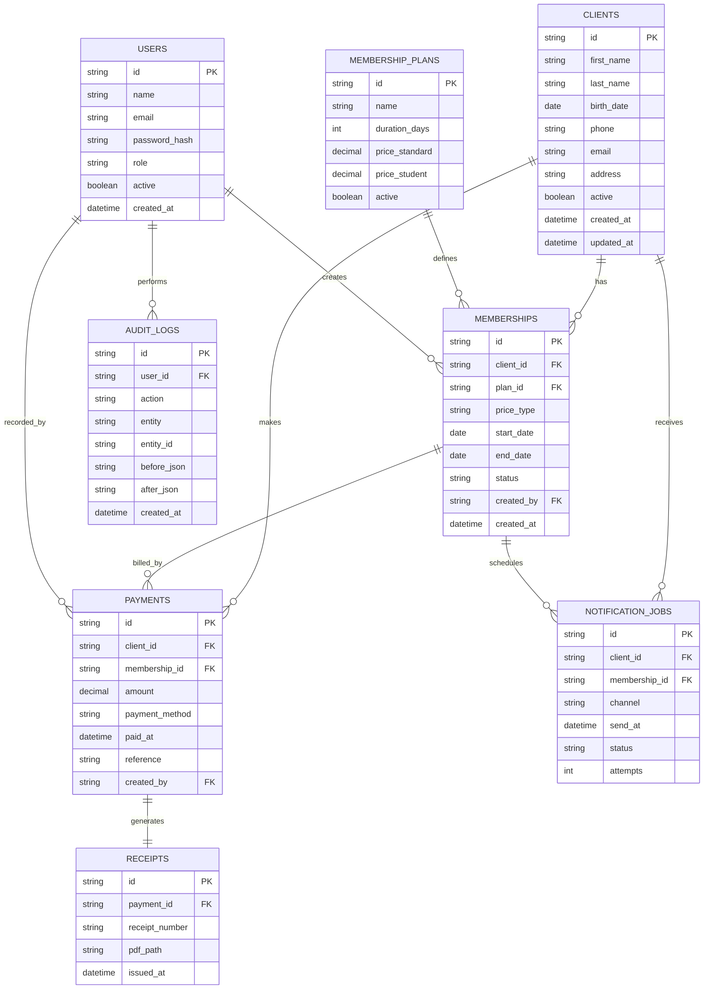
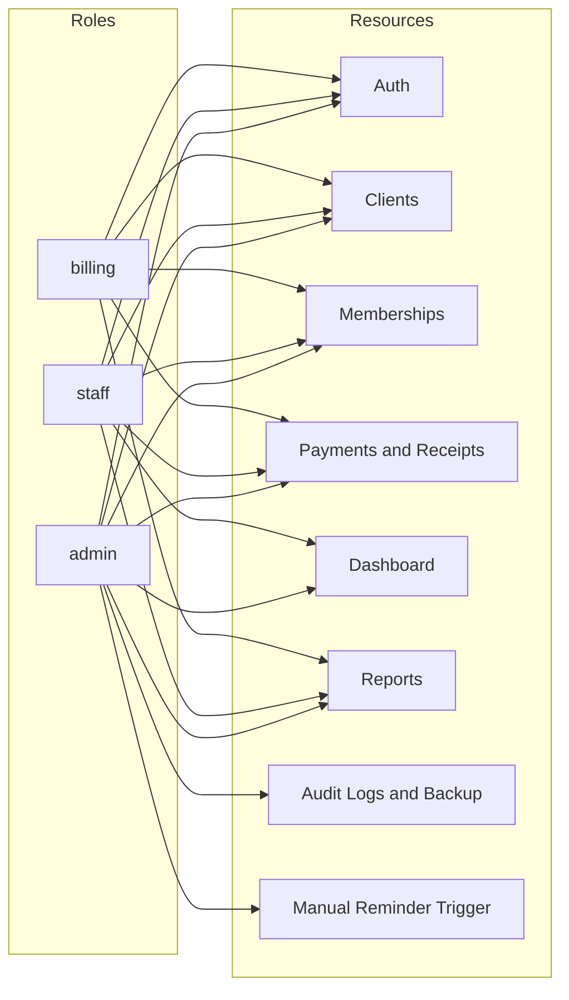
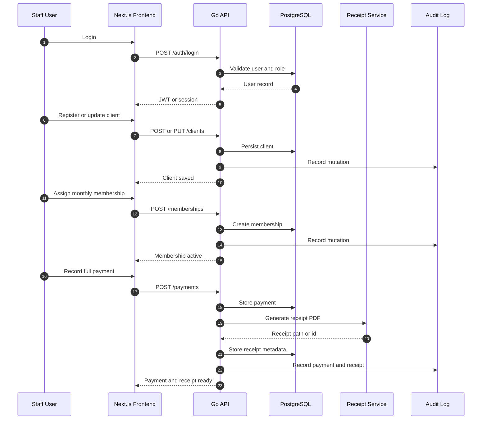
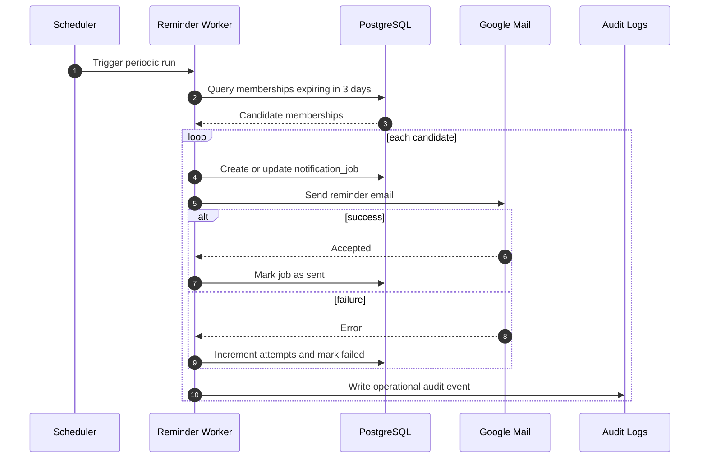
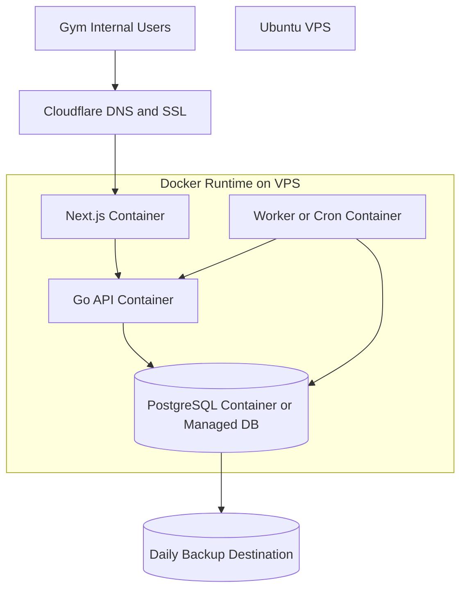
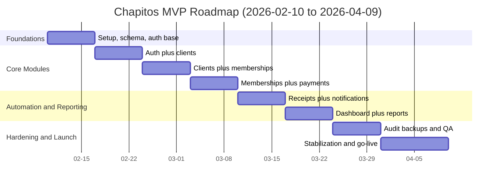
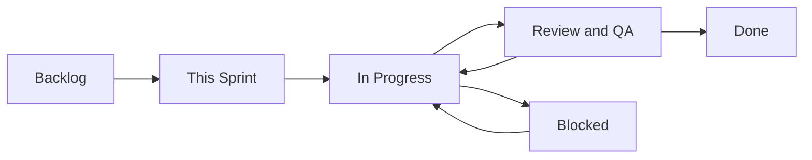

# Chapitos Gym - Development Diagrams

This file consolidates development diagrams based on the documentation set in `docs/` (`mvp-overview`, backend/frontend plans, API contract, architecture notes, roadmap, sprint board, and backlog).

## 1) Product Scope and Actors (MVP)

## 2) High-Level Architecture

## 3) Core Data Model (MVP)

## 4) RBAC Access Model (API v1)

## 5) Main Operational Flow (Client to Receipt)

## 6) Automated Expiration Reminder Flow

## 7) Deployment Topology (MVP)

## 8) Delivery Timeline (8 Weeks)

## 9) Sprint Board Flow

